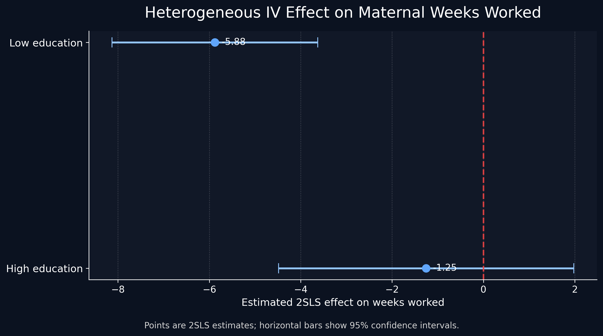

# Angrist & Evans (1998) — IV / 2SLS Replication (Phase 1)

## Track & Paper
- **Track:** Track B (Replication)
- **Paper:** Angrist, Joshua D. & Evans, William N. (1998). *Children and Their Parents’ Labor Supply: Evidence from Exogenous Variation in Family Size*.

## Research Question (Causal)
This project replicates the core causal question in Angrist & Evans (1998): **Does having an additional child causally affect mothers’ labor supply outcomes (e.g., employment and hours worked)?**  
Because family size is endogenous, the paper uses **instrumental variables (IV)**—notably **the occurrence of same-sex first two children** (and related fertility instruments)—to generate exogenous variation in fertility and estimate the causal effect via **2SLS**.

---

## Data Source
Data come from **Joshua Angrist’s MIT data archive** (AngEv98.zip), which includes extracts based on the **1980 and 1990 U.S. Census**.

> **Note:** Raw data files are not uploaded to GitHub due to size limits. This repository preserves the required folder structure and provides instructions to reproduce results locally.

---

## Repository Structure
- `README.md` — project overview and run instructions  
- `data/raw/` — **raw input data** (not tracked in git; contains placeholder `.gitkeep`)  
- `data/processed/` — **processed outputs** generated by notebooks (not tracked in git; contains placeholder `.gitkeep`)  
- `notebooks/01_Data_Cleaning.ipynb` — Phase 1 ingestion notebook (SAS → CSV, preview with `.head()`)  
- `notebooks/02_Replication.ipynb` — replication notebook (IV/2SLS estimation)

---

## How to Run (Phase 1)
1. **Download the dataset** (AngEv98.zip) from the MIT data archive.
2. Extract the raw files and place the required `.sas7bdat` files into:
   - `data/raw/m_d_806.sas7bdat`
   - `data/raw/m_d_903.sas7bdat`
3. Open and run:
   - `notebooks/01_Data_Cleaning.ipynb`

### Expected Phase 1 Output
- The notebook should successfully load the raw data using `pandas.read_sas(...)`
- Display `df.head()` for each dataset to confirm ingestion
- (Optional but recommended) Write processed CSVs to:
  - `data/processed/census_806.csv`
  - `data/processed/census_903.csv`

---

## Notes on Git Tracking
This repo intentionally does **not** track large data files. Folder structure is preserved with `.gitkeep` files:
- `data/raw/.gitkeep`
- `data/processed/.gitkeep`

If you need to reproduce locally, follow the steps above to place raw data under `data/raw/`.
# GenAI Use and Transparency Disclosure

This notebook includes code and analysis developed with the assistance of Generative AI. I used AI primarily as a research and programming assistant to support the implementation of my extension, but I personally reviewed, edited, and executed all final code and interpreted the final results.

## GenAI prompts used
During the project, I used prompts of the following types:

1. **Extension design prompts**
   - Identify a meaningful extension to the original IV paper that adds analytical value.
   - Suggest a Pathway 2 heterogeneous treatment effects design based on maternal education.

2. **Data and variable prompts**
   - Help identify variables in the Census dataset corresponding to:
     - maternal education
     - number of children
     - sex of the first two children
     - maternal labor supply outcomes
   - Suggest how to construct:
     - `more_than_2`
     - `same_sex`
     - `high_edu`

3. **Econometric coding prompts**
   - Write Python/Colab code for subgroup-specific 2SLS estimation.
   - Help specify controls consistently across education subgroups.
   - Help generate code for extracting coefficients, standard errors, and confidence intervals.

4. **Visualization prompts**
   - Write `matplotlib` code for a publication-style horizontal coefficient plot (forest plot).
   - Improve the plot styling for a production-ready final deliverable.

5. **Interpretation prompts**
   - Help summarize the heterogeneous IV findings in plain English.
   - Help write concise result interpretation and executive-summary language.

## GenAI tools used
- ChatGPT
- Google Colab
- Python packages: `pandas`, `numpy`, `matplotlib`, `linearmodels`

## Role of GenAI in this notebook
GenAI was used to accelerate coding, debugging, visualization, and drafting. However, the final empirical specification, subgroup design, and interpretation of results were verified by me and reflect my own review of the output.
# GenAI Transparency Statement

For this extension project, I used Generative AI as a research and coding assistant to help design, implement, and present my analysis. My extension follows **Pathway 2: Heterogeneous Treatment Effects (HTE)** and examines whether the causal effect of having more than two children on maternal labor supply differs by maternal education. I used GenAI to help identify a suitable extension based on the original paper, suggest an education-based subgroup design, clarify which variables in the dataset correspond to fertility, child sex composition, maternal education, and labor supply, and generate Python/Colab code for the subgroup-specific 2SLS models. I also used GenAI to help write plotting code for the final coefficient plot / forest plot and to help interpret the estimated coefficients, standard errors, and confidence intervals in clear language.

The main prompts I used included requests such as: identify a meaningful extension to Angrist and Evans (1998), suggest a Pathway 2 HTE design using maternal education, help construct variables such as `more_than_2`, `same_sex`, and an education-group indicator, write Python code for 2SLS estimation in separate education subgroups, and generate a production-style matplotlib forest plot. The main tools used were **ChatGPT**, **Google Colab**, and the Python libraries **pandas**, **numpy**, **matplotlib**, and **linearmodels**. GenAI was used to accelerate coding, debugging, visualization, and drafting, but I reviewed, edited, and ran all final code myself, and I take responsibility for the final model specification, analysis, and interpretation.
## Step 4.1: The Executive Memo

### Executive Memo

**Bottom Line Up Front (BLUF).**  
My replication and extension suggest that the causal effect is negative: the treatment reduces maternal weeks worked, and this effect is substantially stronger for mothers with lower education. The subgroup IV estimates indicate that the labor-supply response is not uniform, with the largest negative effect concentrated in the low-education group.

**The Mechanism.**  
I use an **instrumental variables (IV)** design to isolate causal variation in the endogenous explanatory variable. Intuitively, the IV strategy works like a naturally occurring random assignment: instead of comparing mothers who may differ in many unobserved ways, I use an external source of variation that shifts the treatment but is not supposed to directly affect maternal weeks worked except through that treatment channel. In real-world terms, this is similar to using an outside policy or institutional rule as a “push” that changes exposure for some individuals but not others, allowing the analysis to approximate a randomized experiment.

**The Visual Evidence.**  
The figure below provides the clearest summary of the extension result. It shows heterogeneous 2SLS estimates by maternal education group, with point estimates and 95% confidence intervals.

  

**Caption:**  
*Heterogeneous IV Effect on Maternal Weeks Worked.* Points denote subgroup-specific 2SLS estimates, and horizontal bars represent 95% confidence intervals. The estimated effect is much more negative for the low-education group (-5.88) than for the high-education group (-1.25). The confidence interval for the low-education group remains below zero, while the interval for the high-education group crosses zero, indicating weaker statistical evidence in that subgroup.

**Business / Policy Implications.**  
The main implication is that average treatment effects can hide important distributional differences. A policy or institutional change that appears moderate on average may impose substantially larger labor-supply costs on lower-education mothers. Stakeholders should therefore avoid one-size-fits-all policy interpretation and instead design targeted support for the most affected subgroup. In practice, that means pairing policy changes with compensating resources, labor-market support, or family assistance for lower-education mothers, who appear most vulnerable to the negative employment response.

**Repository Guide.**  
This repository contains the full empirical workflow, including data preparation, baseline replication, heterogeneous IV estimation, statistical diagnostics, and final visual outputs. The notebook documents each step of the causal analysis, while the figures and memo summarize the most decision-relevant findings.
